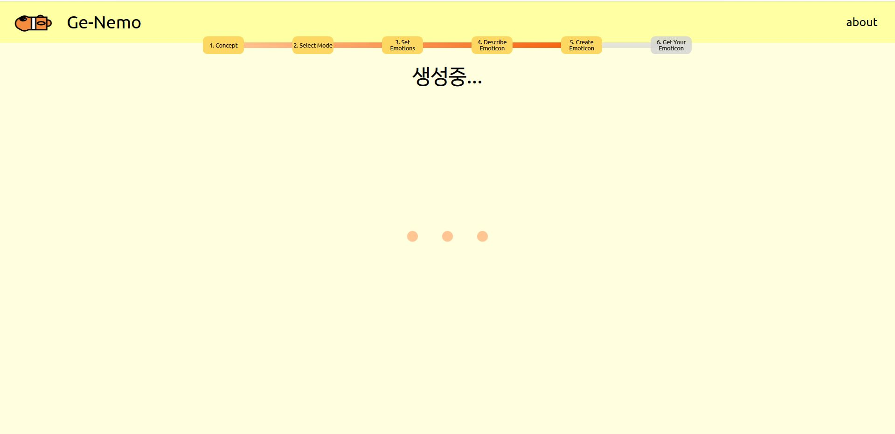

# Emoticon_Create
------
## GE-NEMO: Stable diffusion을 이용한 감성 이모티콘 개인화 서비스 

### 서비스 프로세스
 

사용자가 원하는 이모티콘의 기본 컨셉을 입력합니다. 캐릭터의 외양 묘사가 적합합니다

GE-NEMO의 이모티콘 생성 모드는 두 가지입니다. 
- 간편 모드: '추가 개인화 여부' 선택 페이지에서 '생성하기'를 누르면, 플루치크의 감정 휠에 기반한 기본 감정 32가지를 표현하는 이모티콘이 생성됩니다. 사용자가 개인적으로 커스텀 할 수 없습니다.
- 커스텀 모드: '추가 개인화 여부' 페이지에서 '다음으로' 버튼을 누르면, '감정 설정하기' 페이지로 이동합니다.

사용자는 '중립'을 포함한 폴 에크만의 기본 감정별 이모티콘 장수를 설정합니다.

받고 싶은 32가지 이모티콘을 직접 묘사할 수 있습니다. 특정 모습의 이모티콘을 원할 경우 이곳에 상세하게 작성하면 더 정확한 이모티콘을 받아볼 수 있습니다.

이모티콘 생성 로딩 페이지 (생성에 시간이 소요됩니다.)

이모티콘 생성 완료 페이지. 방향 버튼을 통해 32가지 이모티콘을 확인하실 수 있습니다. 해당 이미지는 예시 이미지입니다.

Stable Diffusion 모델을 파인 튜닝하는 과정에서 모델이 학습한 이미지입니다.

[학습 데이터 링크](https://huggingface.co/datasets/Norod78/microsoft-fluentui-emoji-768/tree/main/data): 저작권 침해 요소가 없는 이모지 이미지 - description 쌍 데이터셋

### 프로젝트 소개 
[발표자료 링크](https://docs.google.com/presentation/d/12lQFW0jblt1QepZf7Gs6UbWcBq0qmZ_S/edit?usp=sharing&ouid=112182077487610203050&rtpof=true&sd=true)

### 폴더 구조

- app &rarr; Flask+React를 활용한 웹어플리케이션 개발이 담겨있는 폴더 
- model &rarr; Stable Diffusion Fine tunning에 대한 과정이 담겨 있는 폴더 
- data &rarr; 사용한 데이터에 대한 설명과 데이터가 담겨 있는 폴더

-----
#### 시스템 구성도 

1. 시스템은 현재 AWS EC2 g3s.xlarge 인스턴스에서 동작하고 있으며 22.06.20에 비용 문제로 인스턴스는 중지될 예정임.

-----
#### contribution
- 김지우
- 박성원
- 성현주
- 최윤수
